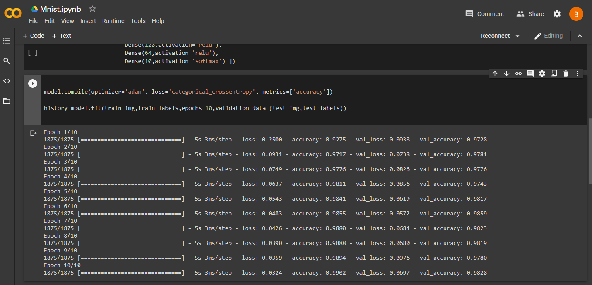
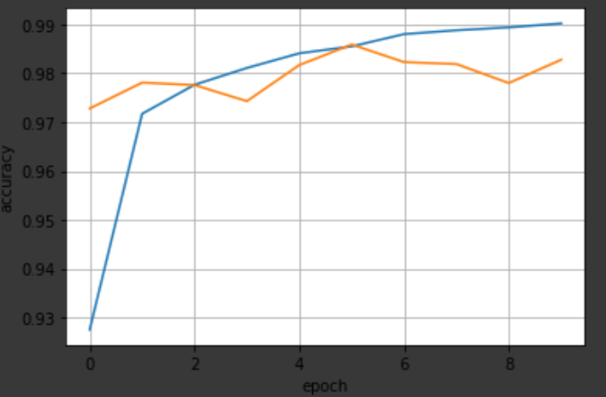

# Classification-of-Handwritten-Digits-using-MNIST-Dataset  
I have created a deep learning model to train it on MNIST Dataset.  
MNIST Dataset contains handwritten digits from 0 to 9 (total 10 classes).There are 70000 images in total.I splitted it as 60000 images for training while 10000 images for testing.  
Every image is of size 28x28.These are grayscale images. Samples of MNIST Dataset is shown below   
I used 3 Conv2D layers and 3 MaxPoolin2D layers and end model network with 3 Dense fully connected layers. I used Adam optimizer.I have also provided the code above with the file name Mnist_training_file.py    
I trained the model till 10 epochs. After it , it started overfitting. Below is the picture in which training and validation accuracy is shown.  
Then i plotted the graph of training vs validation accuracy.Blue line is for training_accuracy while the orange line is for validation accuracy.   
